# Diagramas de Secuencia — Closify

## Flujos internos

### Login

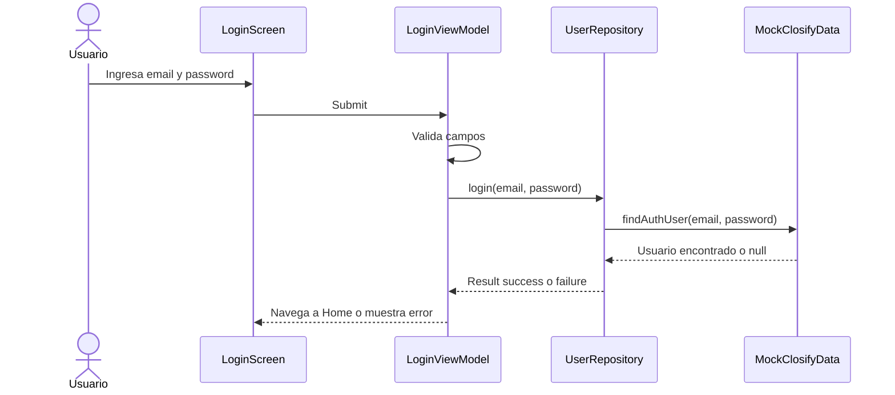

### Registro

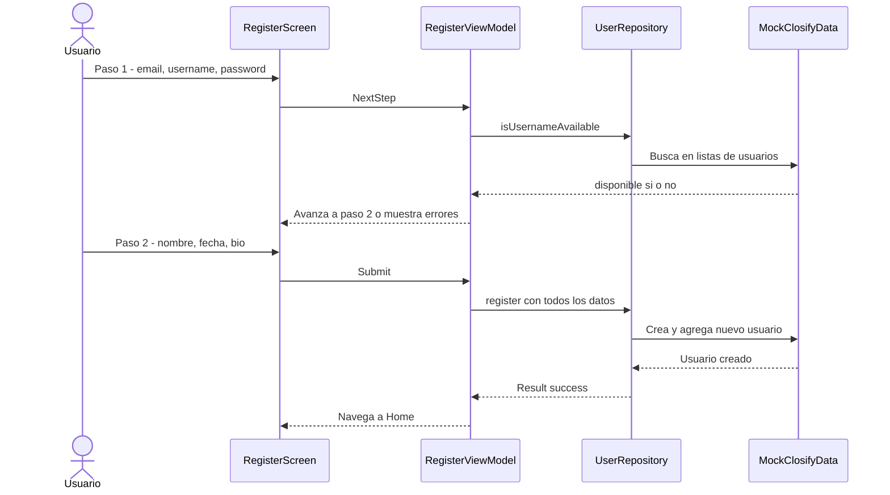

### Generar outfits

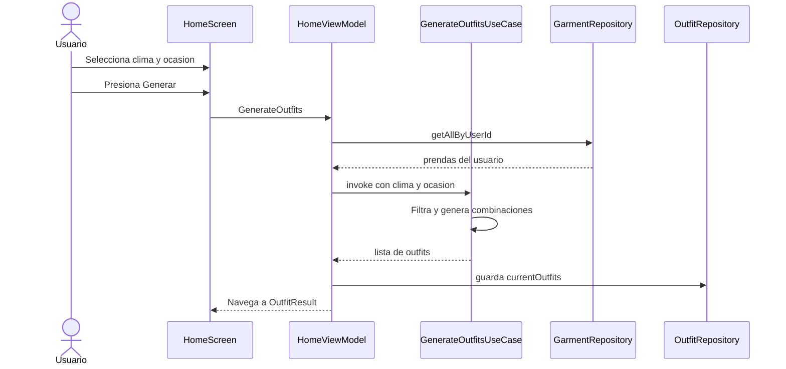

### Guardar outfits favoritos

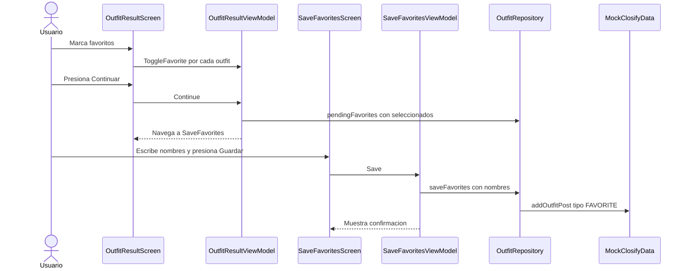

### Agregar prenda

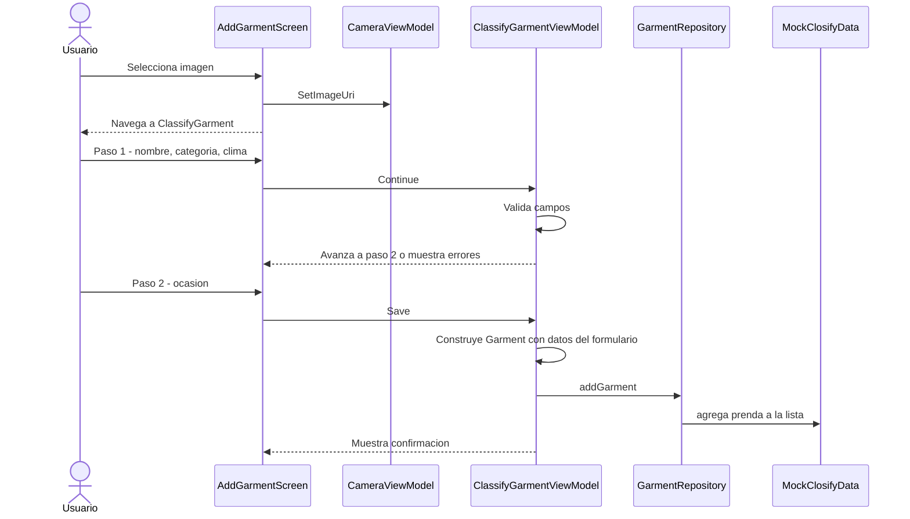

### Planificador

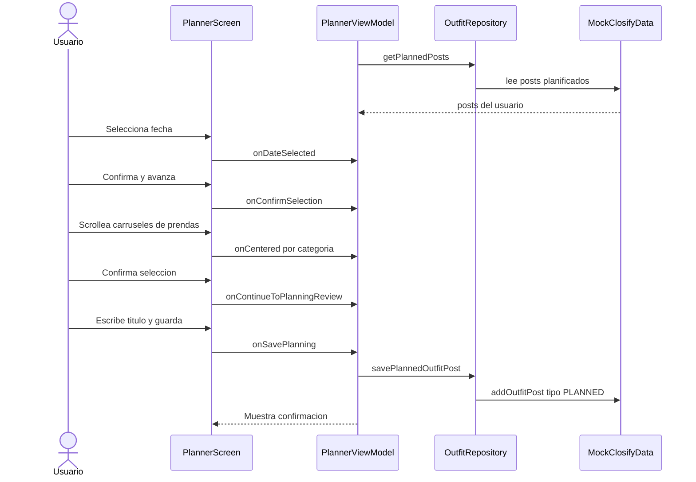

### Amigos

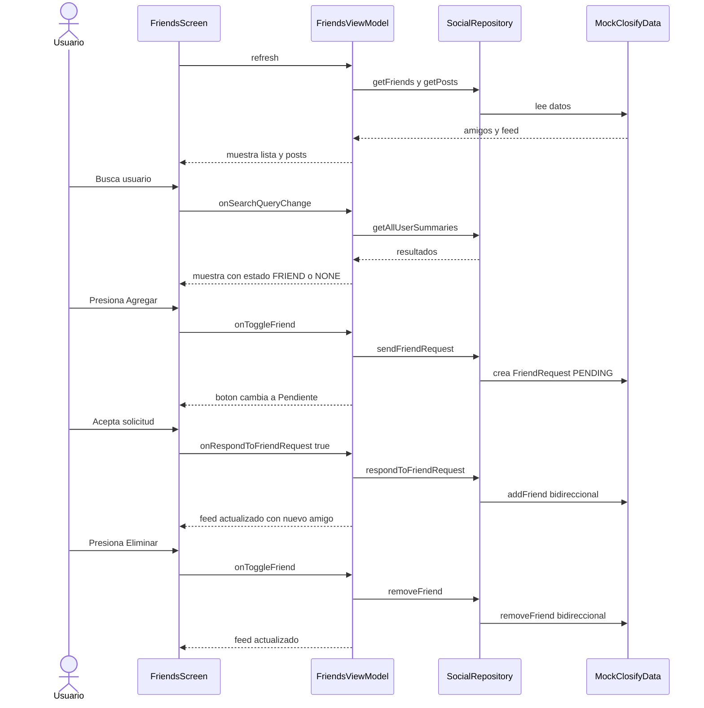

---

## Flujos de integracion futura

### Firebase Authentication

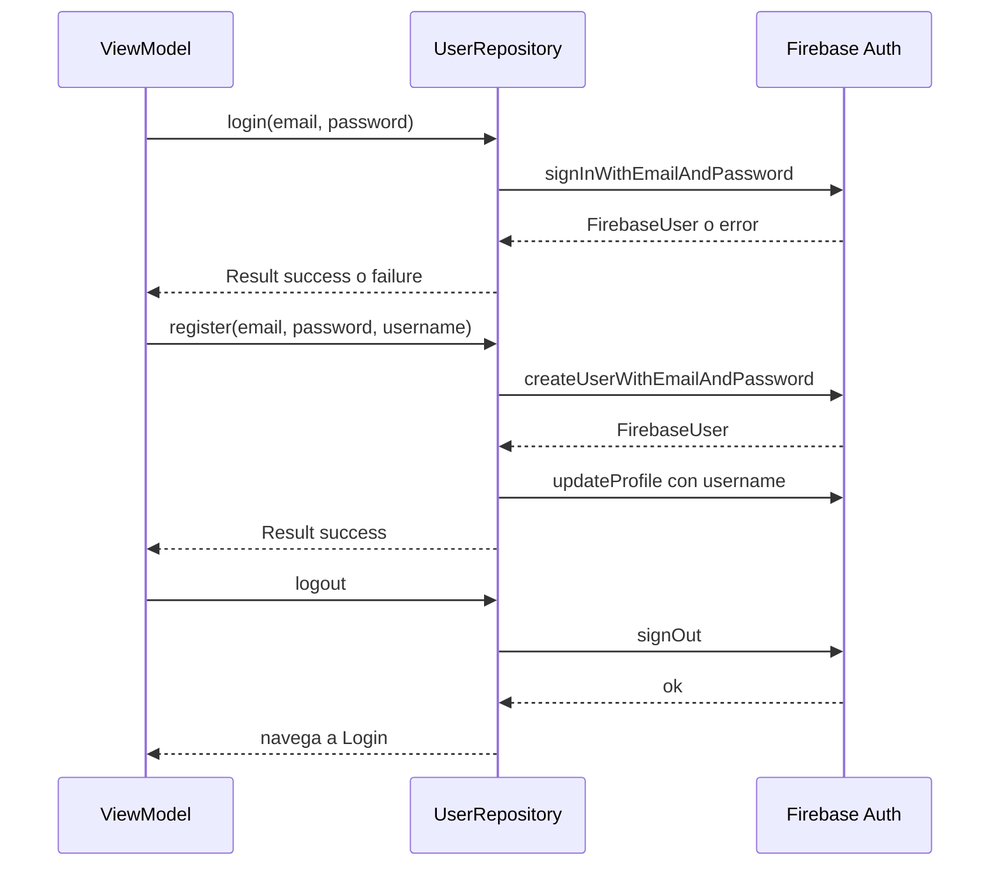

### Firebase Storage y Firestore — Guardar prenda

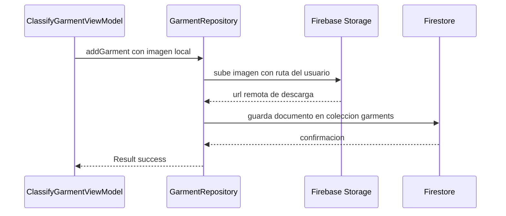

### Firestore — Cargar prendas

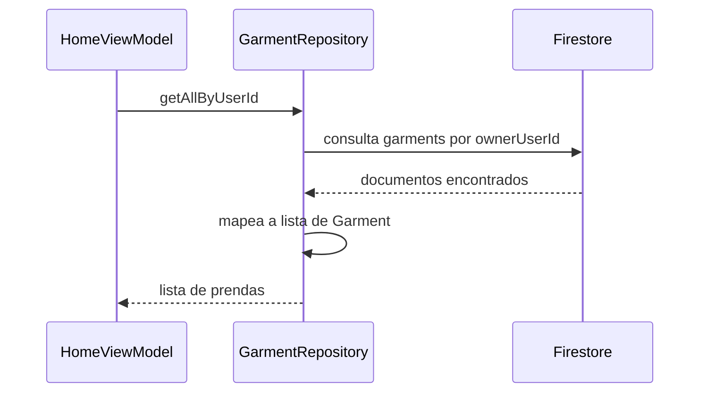

### Firestore — Guardar outfit favorito

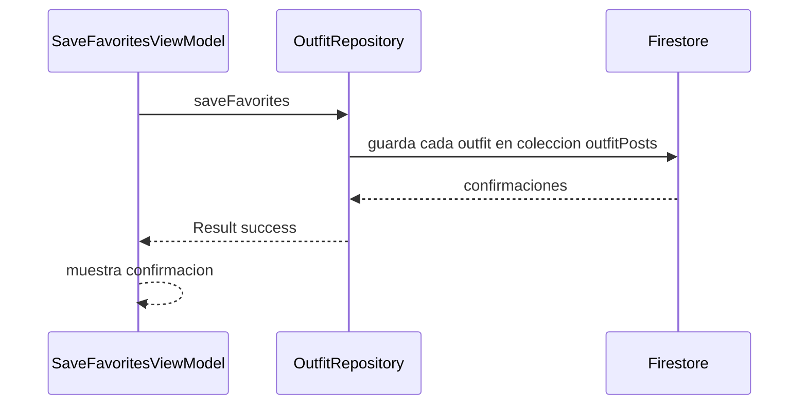

### Firestore — Amigos

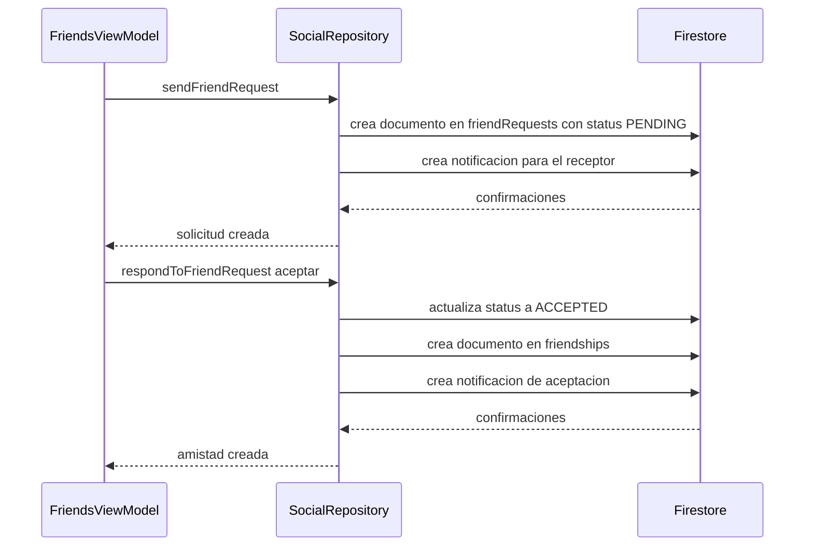

### Retrofit — Pronostico del clima

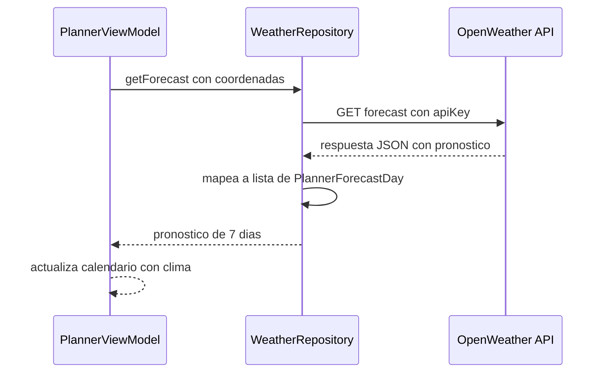
